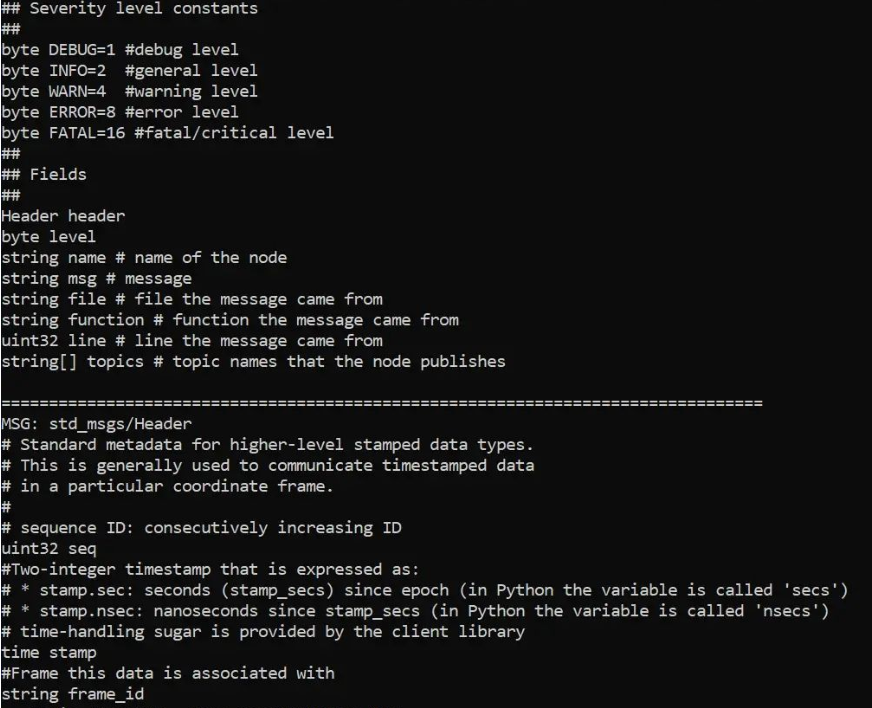

# RosNet Developer Documentation

RosNet uses the [rosbag version 2.0 format](https://wiki.ros.org/Bags/Format/2.0) to parse rosbags to C# objects. A rosbag consists of different records that contain information about the data or the rosbag itself. RosNet uses information from some of these records to parse the rosbag:

- Message data record: The message data record contains two guaranteed header fields: 
    
    * conn: the id of the connection record to which the message data record is connected 

    * time: the time that the message data record was received.
    The data of the message data record is the data we want to extract from the bag.

- Connection record: The connection record contains two guaranteed header fields: 

    * conn: the id of the connection record 

    * topic: the plain text name of the connection

    The connection record also contains a guaranteed data field that is used in RosNet: message_definition is the definition of how the message record data of the message records connected to the connection is formatted. A message definition can for instance look like this:
     

- Chunk record: The chunk record data consists of message records and connection records. The chunk record contains a compression header field which states whether the chunk is compressed (bz2) or not (none). 

## Project setup

### DataModel

#### RosBag

The RosBag class represents a rosbag. The RosBag is empty when it is instantiated, except for the path, and the rosbag is parsed (using the RosBagReader instance) into the RosBag object when the Read method is called. 

#### Connection

The Connection class represents a connection record and has a list of Message instances that consists of the messages connected to this connection.

#### Message

The Message class represents a message data record with fields for each header field and a dictionary containing the data of the message data record. The data are a collection of fields, so the dictionary, therefore, consists of keys which are the Name of the FieldValue instance and the value is the FieldValue.

#### Time

Time is a class used for the Time and Duration primitive types which are defined field types for messages in ROS. The class is comparable and has the function ToDateTime() that returns the Time as a DateTime object, assuming the Time instance is given as unix time.

### Type

#### PrimitiveType

PrimitiveType is an Enum with the datatypes that correspond to the [standard datatypes](https://wiki.ros.org/msg) in ROS messages, and an array type used for fields which are arrays of values.

##### Conversion between PrimitiveType and C# types

| PrimitiveType | C# type               |
| -----------   | -----------           |
| Bool          | bool                  |
| Byte          | sbyte                 |
| Char          | char                  |
| Duration      | RosNet.DataModel.Time |
| Float32       | float                 |
| Float64       | double                |
| Int8          | sbyte                 |
| Int16         | short                 |
| Int32         | int                   |
| Int64         | long                  |
| Time          | RosNet.DataModel.Time |
| Uint8         | byte                  |
| Uint16        | ushort                |
| Uint32        | uint                  |
| Uint64        | ulong                 |

### Field

The Field folder contains the two different models used for fields in the message data record data.

#### FieldValue

FieldValue is a custom data type with a string for the name of the field, a PrimitiveType instance called Datatype which is the datatype of the field, and a bytearray called Value which is the value of the field. 

#### ArrayFieldValue

ArrayFieldValue represents a fieldvalue that is an array of fieldvalues.

### RosMessageParser

The RosMessageParser-folder contains the logic for parsing the message_definition field in connections and for parsing the data of message data records using the corresponding message_definition.

#### MessageDefinitionParser

The MessageDefinitionParser parses a message definition to a list of fieldvalues with name and datatype (no value). The parser ignores commentlines (starts with #). A messagedefinition consists of the main definition (the first) and subdefinitions such as Header that is splitted with a line of “=”. The parser splits the different definitions and parses the subdefinitions from bottom to the first (main), because the subdefinitions above can contain the subdefinitions below. To parse a definition, the parser goes through each line and checks whether the field type (first word in line) is a fixed-length array ( ends with [#]), array (ends with []), PrimitiveType or a name of a subdefinition. The parser uses a dictionary with the name of the subdefinitions as the key and a list of fieldvalues that are in that subdefinition as values. These are used when the field type is a subdefinition such as “Header”, and the field is replaced with the fieldvalues of that subdefinition. 

#### MessageDataParser

The MessageDataParser takes in a bytearray of data and a messagedefinition with a list a fieldvalues. It iterates through each fieldvalue in the list and creates a dictionary with the name of the fieldvalue as key and a new fieldvalue consisting of the original fieldvaluename, datatype and value (read from the bytearray) as value.

### RosReader

#### RosBagReader

The RosBagReader class is the class containing the overall logic for parsing the rosbag. It reads the header of the records using the headerlength and uses the “op” value to determine what type of record it is. Using the “op” value, the reader parses the record data according to the record type. All connections are added to the rosbag that is put into the function as a parameter and all messages are kept in a UnParsedMessageHandler-instance until the whole rosbag is read. In the end, all the messages are parsed by the UnParsedMessageHandler and they are added to the connection they belong to. 

#### UnParsedMessageHandler

The UnParsedMessageHandler contains a dictionary with the connection id as the key and a list of message and byte array-tuples that are messages and their unparsed data that connects to the connection. The ParseMessages()-method goes through the whole dictionary and parses the message data and adds the messages to their corresponding connections.